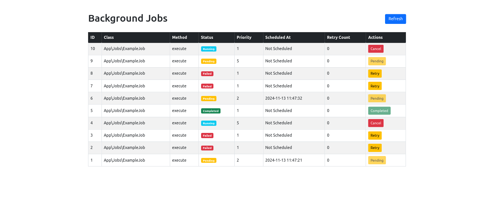

# Laravel Background Job Processor

A Laravel-based background job processing system with custom queue management. This application allows you to add, process, and retry background jobs, with easy monitoring and logging.

## System Requirements

- **PHP**: v8.2.24
- **MySQL**: v8
- **Laravel**: v11.30.0
- **GIT**
- **COMPOSER**
- **Bootstrap**

## Project Setup

### Environment Configuration

Create a working directory and clone

git clone https://github.com/hafeezazhar2/custom-jobs.git

Create MySql database and Update the `.env` file with your database credentials:

```plaintext
DB_CONNECTION=mysql
DB_HOST=127.0.0.1
DB_PORT=3306
DB_DATABASE=*****
DB_USERNAME=*****
DB_PASSWORD=*****
```
## To specify the path for backend workers:

 ```plaintext
 Linux: APP_PATH=/path/to/job-runner
 Windows: APP_PATH=D:/home/hafeez/job-runner
```
## Install Dependencies

Run the following command to install all necessary dependencies:

composer install

## Database Migrations

Set up the database structure with migrations:

php artisan migrate

## Start the Application

To serve the application:

php artisan serve

## Background Worker and Sample Jobs
### Background Worker and Sample Jobs

To add sample jobs and initiate the background worker, visit:

```plaintext
http://127.0.0.1:8000/jobs/add-sample-jobs
```

This endpoint will:
- Add sample jobs to the job queue.
- Trigger the background worker to start processing the queue.

You can also start the worker by running the following commands from the command line (CLI):

**Linux:**
```bash
nohup php artisan background-jobs:process > /dev/null 2>&1 &
```

**Windows:**
```plaintext
start /B php artisan background-jobs:process
```

As I am using Linux/Ubuntu, you can verify the status of the worker by using the following command:
```bash
ps aux | grep 'php artisan background-jobs:process'
```

This will also add sample data.

## Job Listing
You can access the job listing page at:
```plaintext
http://127.0.0.1:8000
```

You will see an interface like the following image:



## Error Log

Errors and information will be logged into `background_jobs_errors.log`.

Retry jobs will execute after a 2-minute delay.

